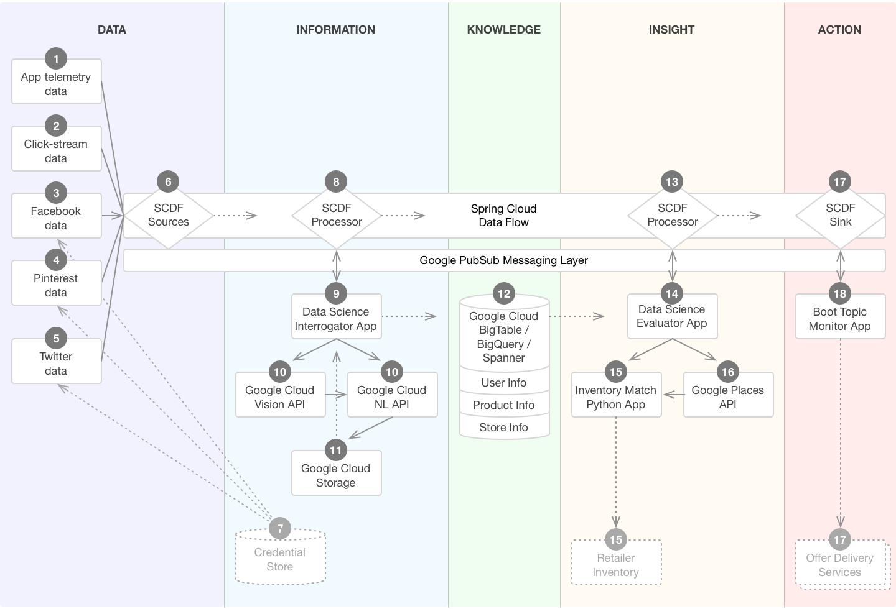
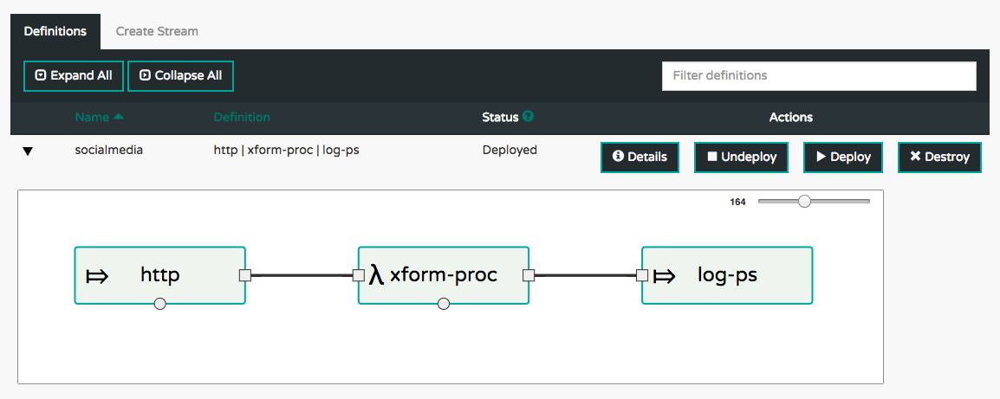

# PCF + GCP Retail Demo



## A demo for retailers to see how PCF and GCP turn streams of data into action. 

## Prerequisites

* Install the GCP Service Broker, available on [Pivotal Network](https://network.pivotal.io/products/gcp-service-broker/)
  (source is [GitHub](https://github.com/GoogleCloudPlatform/gcp-service-broker))
* Java 8 JDK installed
* [Git client](https://git-scm.com/downloads) installed
* Using the Git client, clone [this repo](https://github.com/mgoddard-pivotal/pcf-gcp-retail-demo)
* Change into this newly created directory: `cd ./pcf-gcp-retail-demo`

## Install Spring Cloud Dataflow (SCDF) server

SCDF is the foundation of the data flow through this system.  The server orchestrates the data streams,
which are composed of modular building blocks.  These can be _Source_, _Processor_, or _Sink_.  There
is a large set of out of the box components available and, since they are Spring Boot apps, it is easy
to build a customized module.

1. Download the SCDF server and client JAR files, as documented [here](http://docs.spring.io/spring-cloud-dataflow-server-cloudfoundry/docs/current-SNAPSHOT/reference/html/_deploying_on_cloud_foundry.html#_download_the_spring_cloud_data_flow_server_and_shell_apps)
1. Configure the [manifest](./scdf/scdf_server_manifest.yml)
1. Ensure RabbitMQ, MySQL, and Redis tiles are installed (Ops Manager)
1. Create service instances of each of these, using `cf cs ...`
1. Push this app to PCF on GCP
1. Ensure it is running
1. Access the SCDF Dashboard (at `https://dataflow-server.YOUR_PCF_INSTALL.DOMAIN/dashboard/`)
1. Start the SCDF Client you downloaded in a previous step: `java -jar spring-cloud-dataflow-shell-1.1.2.RELEASE.jar`

## Set up the SCDF stream "data backbone"
Initially, configure a simple stream to illustate the following data flow:
* [Social media API client](./mock-source) (see 3, 4, 5 in diagram) periodically POSTs data to ...
* a SCDF HTTP Source (item 6 in the diagram),
* which is routed through a custom [SCDF Processor](./transform-proc) (item 8 in diagram),
  where data normalization and enrichment are done.
* Finally, the stream terminates with the [SCDF Sink](./log-sink) component (item 17 in diagram).

### Build and upload your SCDF modules
1. Build the Processor project: `( cd ./transform-proc/ && ./mvnw clean package )`
1. Upload the resulting JAR, `./transform-proc/target/transform-proc-0.0.1-SNAPSHOT.jar`, into a Cloud Storage bucket,
   so SCDF is able to acces it.
1. Build the Sink project: `( cd ./log-sink/ && ./mvnw clean package )`
1. And upload its JAR, `./log-sink/target/log-sink-0.0.1-SNAPSHOT.jar`, to Cloud Storage.

### Import these modules into SCDF for use in creating streams
1. You can do this using the SCDF Dashboard (see above), by clicking the "APPS" tab,
1. then, click "Bulk Import Applications",
1. then, under "Out-of-the-box Stream app-starters", click the "Action" button associated with the
   "Maven based Stream Applications with RabbitMQ Binder" row.
1. To import the two custom built apps which were uploaded to Cloud Storage, you need to
   go back to the "APPS" tab,
1. then click the "+ Register Application(s)" button, then populate the various fields, clicking the
   "+" icon under "Actions" after you enter the first one, to provide a second set of inputs.  Check
   the "Force" box, and note that this demo will name them _xform-proc_ and _log-ps_.

### Set up the stream
1. Still within the SCDF Dashboard, click the "STREAMS" tab.
1. Click "Create Stream"
1. From the available modules, click the "http" module and drag it to the canvas area.
1. Repeat this for "xform-proc" and "log-ps" modules.
1. With the three modules now on the canvas, using the mouse, create connections between them.
1. Click "Create Stream", and fill in values for the stream name (we use "socialmedia" here).
1. Click the "Deploy stream(s)" check box.
1. Click "Create".
1. Click the "Definitions" tab, which should show a view similar to this:



### Set up the social media API client
* Push the app: `( cd ./mock-source/ && cf push --no-start )`
* Using `cf apps`, note the value in the "urls" column for the app whose name ends in "-http"
* Now, create a service named "http-hub" using a URI based on that value: `cf cups http-hub -p '{"uri": "http://dataflow-server-hf30QYI-socialmedia-http.YOUR_PCF_INSTALL.DOMAIN"}'`
* Bind this newly pushed app to this service instance: `cf bs mock-source http-hub`
* Finally, start this app: `cf start mock-source`

### Simulate the social media API interaction, sending events
* Find the URL for this "mock-source" app, from the output of `cf apps`
* Simulate the flow of events through this endpoint: `while `true` ; do curl http://mock-source.YOUR_PCF_INSTALL.DOMAIN/datetime ; sleep $( perl -e 'print int(1 + 15*rand()) . "\n"' ) ; done`
* Tail the logs for the sink, the app whose name ends in "-log-ps": `cf logs dataflow-server-hf30QYI-socialmedia-log-ps`

Every so often (at intevals ranging from 1 to 15 seconds), a log entry should appear:
```
2017-02-24T06:55:36.95-0500 [APP/PROC/WEB/0]OUT 2017-02-24 11:55:36.955  INFO 20 --- [c.socialmedia-1] log.sink                                 : {"date_time": "02/24/17 11:55:36"} (11 days 'til GCP NEXT)
```

### Review of what we have, so far
* "mock-source" represents the yet-to-be-implemented social media data source,
  and we can POST data to it. As envisioned, there would be several such components,
  all falling within this "DATA" area of the diagram, one per social media platform.
  The way this is decoupled, by having only a REST interface with the SCDF HTTP Hub,
  allows for developers to build each of these using whichever technology is most
  appropriate, the best match for the skills of the team and the social media API.
* SCDF HTTP Hub is just an out-of-the-box SCDF app.  Its role here is simply to accept
  inputs from any of the disparate sources, and put these into the data stream.
* SCDF Processor, so far, is accepting input, which so far is just the simple JSON
  string representing the current date and time, as defined in mock-source:
  `{"date-time": "02/24/17 02:04:23"}`.  It parses the JSON message, computes the
  number of days between the given date and the date of the GCP NEXT, defined within
  `./transform-proc/src/main/resources/application.properties`, enriches that data
  stream based on this computation, and emits the result into its outbound channel.
* SCDF Sink simply takes this input and logs it.

## Resources
* [Document showing how to create Spring Cloud Stream components bound to Google PubSub](./docs/GooglePubSubBinderandSCDF.pdf)
* [Spring Initializr for Stream Apps](http://start-scs.cfapps.io/)
* [Read this](http://docs.spring.io/spring-cloud-dataflow-server-cloudfoundry/docs/1.1.1.RELEASE/reference/htmlsingle/#getting-started-maximum-disk-quota-configuration) if SCDF Server runs out of disk space.
* We may want to look at validating the inputs coming from the various sources.
  Something like this, as is done with [GitHub "webhooks"](https://developer.github.com/webhooks/),
  might work:
```python
      # Validate signature against GitHub Webhook secret, only if environment variable
      # GIT_WEBHOOK_SECRET is set
      global git_webhook_secret
      if git_webhook_secret:
        log("Comparing SHA1 digests for payload")
        if type(git_webhook_secret) == unicode:
          git_webhook_secret = git_webhook_secret.encode()
        signature = request.headers.get("X-Hub-Signature").split('=')[1]
        mac = hmac.new(git_webhook_secret, msg = request.data, digestmod = sha1)
        if compare_digest(u'{0}'.format(mac.hexdigest()), u'{0}'.format(signature)):
          log("Digests match -- proceeding")
        else:
          log("Digests don't match -- aborting")
          abort(403)
```
* One possibly useful [Instagram API client](https://github.com/LevPasha/Instagram-API-python)

