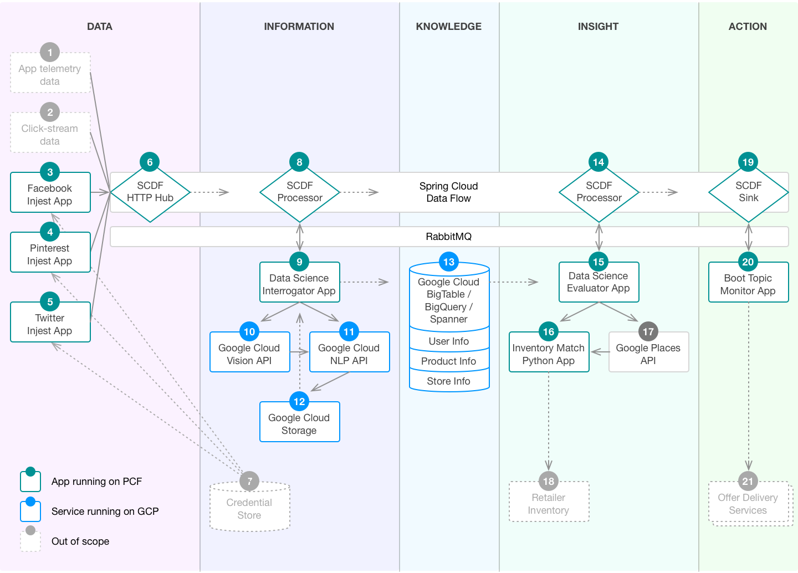

# PCF on GCP Retail Demo

## A demonstration of combining PCF running on GCP to help retailers stay close to their customers



## Prerequisites
* Install the GCP Service Broker, available on [GitHub](https://github.com/GoogleCloudPlatform/gcp-service-broker)
or [Pivotal Network](https://network.pivotal.io/products/gcp-service-broker/)
* Java 8 JDK installed
* [Git client](https://git-scm.com/downloads) installed
* Build a fork of the [Spring Cloud Stream Binder for Google PubSub](https://github.com/mgoddard-pivotal/spring-cloud-stream-binder-google-pubsub) project:
    - Clone the repo: `$ git clone https://github.com/mgoddard-pivotal/spring-cloud-stream-binder-google-pubsub.git`
    - Change into the new directory: `$ cd spring-cloud-stream-binder-google-pubsub/`
    - Build and install the JAR: `$ bash ./mvnw -U clean install`

## Resources
* [Document showing how to create Spring Cloud Stream components bound to Google PubSub](./docs/GooglePubSubBinderandSCDF.pdf)
* [Spring Cloud Dataflow Server, with changes to specify Google Cloud role during bind](https://storage.googleapis.com/mgoddard-jars/spring-cloud-dataflow-server-cloudfoundry-1.1.1.BUILD-SNAPSHOT.jar)
  That version of the SCDF Server JAR was built with a patched version of [Spring Cloud Deployer for Cloud Foundry](https://github.com/spring-cloud/spring-cloud-deployer-cloudfoundry),
  to specify the Google Cloud role at bind time. The CloudFoundryAppDeployer.java file was modified:
    ```
    private Mono<Void> requestBindService(String deploymentId, String service) {
      return this.operations.services()
        .bind(BindServiceInstanceRequest.builder()
        .parameter("role", "pubsub.admin") // This was added
        .applicationName(deploymentId)
        .serviceInstanceName(service)
        .build());
    }
    ```

